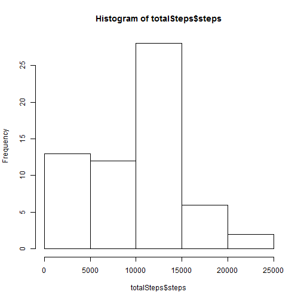
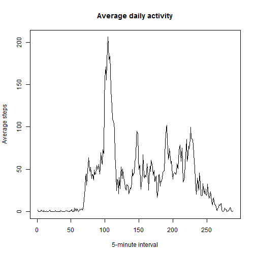
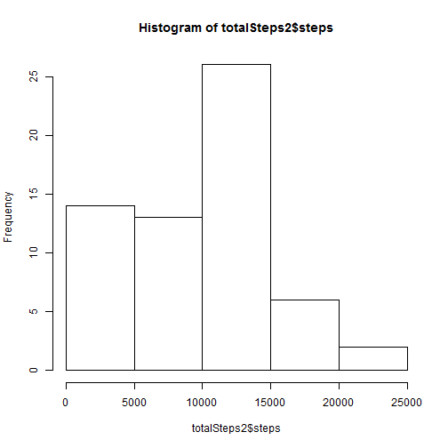
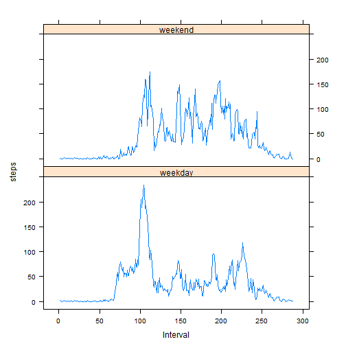

Reproducible Research: Peer Assessment 1
==============================


To get idea about this assignment go to [read me][1] file 


## Loading and preprocessing the data

Here the data will be load from a compressed file available at the directory.
Then conversions will be done so the data would fit to be usable. 

#### Load the data

```r
file <- unz("activity.zip", "activity.csv")
data <- read.csv(file, colClasses = c("numeric", "character", "numeric"))

data$date <- as.Date(data$date, format = "%Y-%m-%d")  #convert date from characters data into date 

data$interval <- factor(data$interval)  #convert intervals to factor
activity <- data
```


#### Process/transform the data (if necessary) into a format suitable for your analysis


```r
totalSteps <- sapply(split(data$steps, data$date), sum, na.rm = T)
totalSteps <- data.frame(date = names(totalSteps), steps = totalSteps)
```


## What is mean total number of steps taken per day?


#### Make a histogram of the total number of steps taken each day

```r
hist(totalSteps$steps)
```

 


#### Calculate and report the **mean** and **median** total number of steps taken 
per day 


```r
StepsMean <- mean(totalSteps$steps)
StepsMedian <- median(totalSteps$steps)
```

* **mean** total number of steps taken per day is 9354.2295 steps.
* **median** total number of steps taken per day is 1.0395 &times; 10<sup>4</sup> steps.
    
    
## What is the average daily activity pattern?


#### Make a time series plot (i.e. type = "l") of the 5-minute interval (x-axis) and the average number of steps taken, averaged across all days (y-axis)


```r
stepsInterval <- aggregate(steps ~ interval, data = activity, FUN = mean, na.rm = TRUE)
plot(steps ~ as.numeric(interval), data = stepsInterval, type = "l", xlab = "5-minute interval", 
    ylab = "Average steps", main = "Average daily activity")
```

 


#### Which 5-minute interval, on average across all the days in the dataset, contains the maximum number of steps? 

```r
maxStepsInterval <- stepsInterval[which.max(stepsInterval$steps), ]$interval
```


The **835th** interval.


## Imputing missing values


#### Calculate and report the total number of missing values in the dataset (i.e. the total number of rows with NAs)

```r
missingVals <- sum(is.na(activity$steps))
missingVals
```

```
## [1] 2304
```

2304 missing Vlaues.

#### Devise a strategy for filling in all of the missing values in the dataset. The strategy does not need to be sophisticated. For example, you could use the mean/median for that day, or the mean for that 5-minute interval, etc.

This function fills missing values with the mean for that 5-minute interval. 

```r
FillActivities <- function() {
    count = 0
    FillActivity <- activity
    for (i in 1:nrow(activity)) {
        if (is.na(activity[i, ]$steps)) {
            FillActivity[FillActivity$interval == i, ]$steps <- stepsInterval[stepsInterval$interval == 
                i, ]$steps
            count = count + 1
        }
    }
    cat("Total ", count, "NA values were filled.")
    FillActivity
}
```


#### Create a new dataset that is equal to the original dataset but with the missing data filled in.


```r
activityFilled <- FillActivities()
```

```
## Total  2304 NA values were filled.
```


#### Make a histogram of the total number of steps taken each day and Calculate and report the mean and median total number of steps taken per day. 

```r
totalSteps2 <- aggregate(steps ~ date, data = activityFilled, sum)
hist(totalSteps2$steps)
```

 

```r
NewMean <- mean(totalSteps2$steps)
NewMedian <- median(totalSteps2$steps)
```

* **mean** total number of steps taken per day is 9408.7993.
* **median** total number of steps taken per day is 1.0384 &times; 10<sup>4</sup>.

#### Do these values differ from the estimates from the first part of the assignment? What is the impact of imputing missing data on the estimates of the total daily number of steps?

* There is 54.5697 steps as mean difference after data filling.
* There is -10.9057 steps as median difference after data filling.


## Are there differences in activity patterns between weekdays and weekends?


#### Create a new factor variable in the dataset with two levels - "weekday" and "weekend" indicating whether a given date is a weekday or weekend day


```r
activityFilled$day = ifelse(as.POSIXlt(as.Date(activityFilled$date))$wday%%6 == 
    0, "weekend", "weekday")
activityFilled$day = factor(activityFilled$day, levels = c("weekday", "weekend"))
```


#### Make a panel plot containing a time series plot


```r
stepsInterval2 = aggregate(steps ~ interval + day, activityFilled, mean)
```


```r
library(lattice)
xyplot(steps ~ as.numeric(interval) | factor(day), data = stepsInterval2, aspect = 1/2, 
    type = "l", xlab = "Interval")
```

 

**People tend to walk more on weekends**

[1]: https://github.com/Shibrain/RepData_PeerAssessment1/blob/master/README.md "read me"
